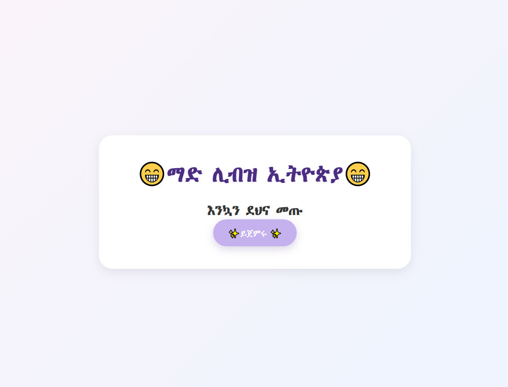
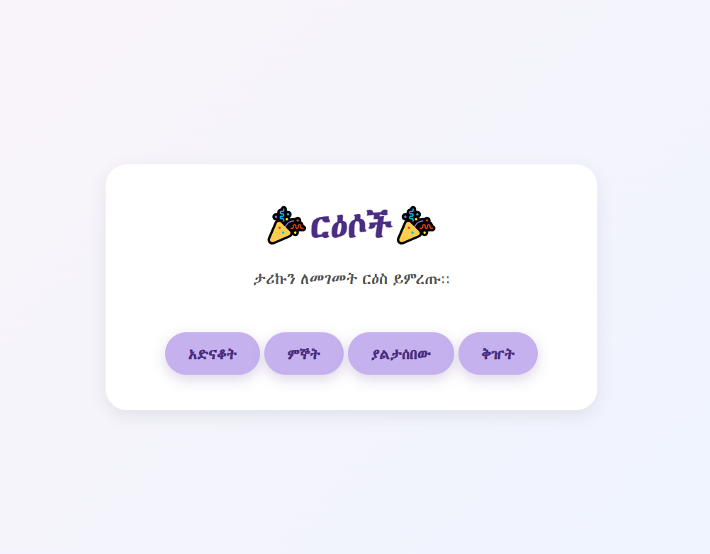
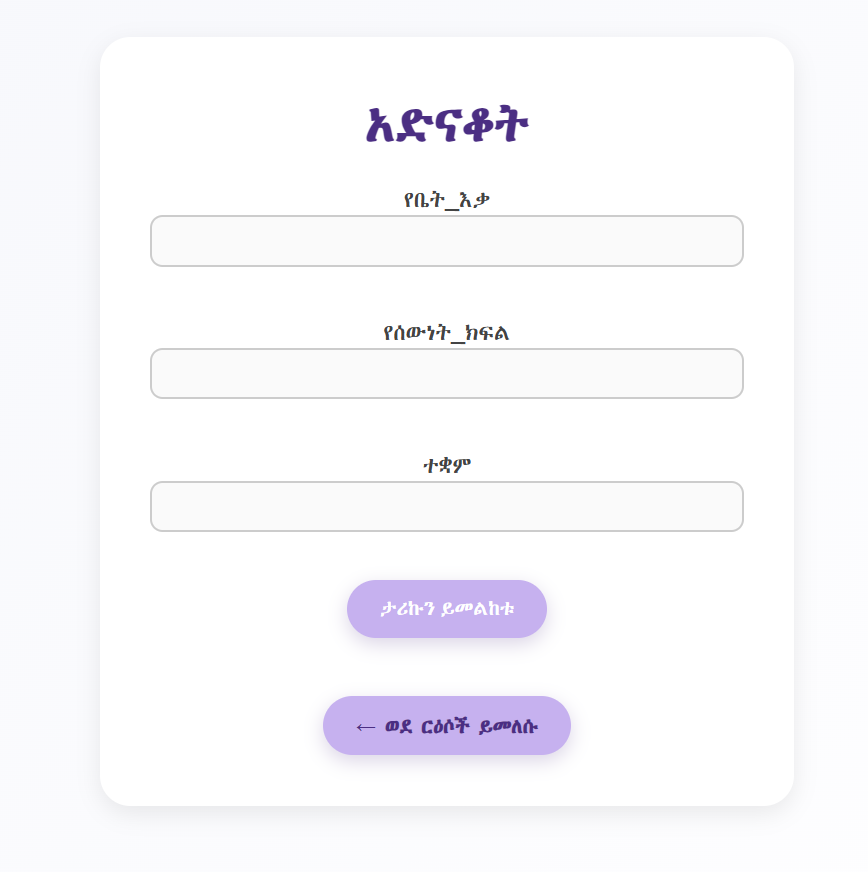

# 🇪🇹 Mad Libs Ethiopian Version 🗣️

A fun and culturally-tailored Mad Libs word game built with **HTML**, **CSS**, and **Python (Flask)**. Players input Amharic/Ethiopian-themed words into a form, and the app generates a hilarious story using their words!



---

## 🔗 Live Demo

👉 [Click here to play it live!](https://mad-libs-ethiopian-version.onrender.com)

---

## 📸 Screenshots


### 😂 Story topics



### ✍️ Input Page




---

## 🚀 Features

- 🗣️ Input Ethiopian nouns, verbs, places, and more
- 🤣 Generate a funny personalized story
- 🎨 Clean and responsive user interface
- 🧠 Culturally familiar names, terms, and references

---

## 🛠️ Tech Stack

- **Frontend**: HTML, CSS
- **Backend**: Python (Flask)
- **Deployment**: Render

---

## 🧑‍💻 How to Run Locally

### 1. Clone the Repository

```bash
git clone https://github.com/linat117/mad-libs-ethiopian-version.git
cd mad-libs-ethiopian-version
